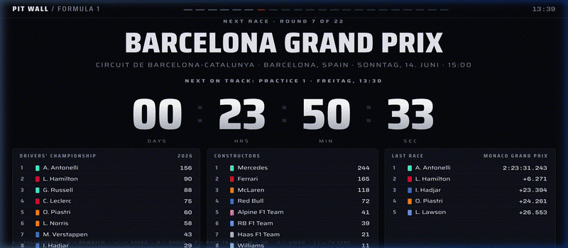
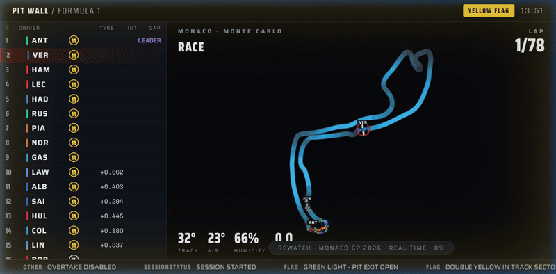
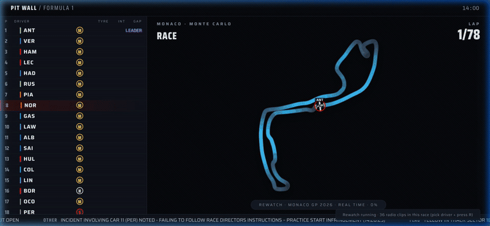
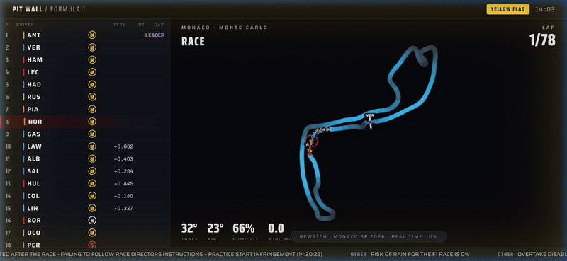
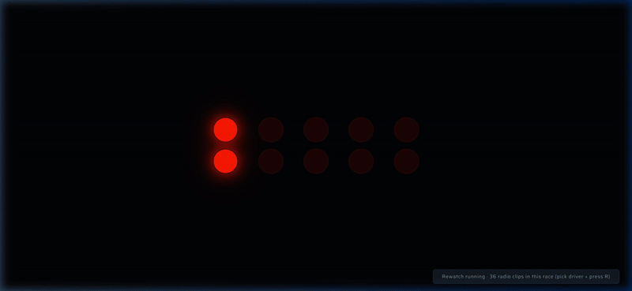
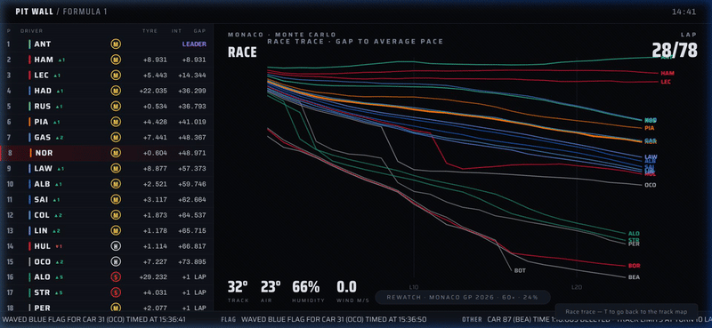

# F1 Pit Wall

A self-hosted Formula 1 live timing display. Idle countdown and standings between races, automatic switch into a live timing tower + telemetry-drawn track map during sessions, and an offline rewatch mode for any past Grand Prix.

**Live demo:** https://jangradwohl.github.io/f1-pitwall/



Single HTML file for the frontend, a small Node proxy for caching and rate limiting. No build step, no npm dependencies, no framework.

---

## Run it

Requires Node 18+ (uses the built-in `fetch`/`URL`/`https` only).

```bash
git clone https://github.com/JanGradwohl/f1-pitwall.git
cd f1-pitwall
node server.js
# open http://localhost:8000
```

That's the whole setup. No `npm install` — `package.json` has no dependencies; it only exists so platforms like Render or Fly recognize the start command.

The frontend can also be opened directly as a static file, but the proxy is recommended: it caches upstream responses, enforces the free-tier rate limits, and survives short upstream outages by serving stale data.

### Hosting it online (free tier)

**GitHub Pages (static, zero-cost, no server).** The frontend defaults to calling the OpenF1 and Jolpica APIs directly, and only switches to the bundled proxy if a `/api/health` endpoint answers on the same origin. Both APIs send `Access-Control-Allow-Origin: *`, so the page works as a pure static site:

1. Push the repo to GitHub.
2. Settings → Pages → Source: *Deploy from a branch* → `main` / `/ (root)`.
3. It goes live at `https://<user>.github.io/f1-pitwall/`.

The trade-off is that there's no shared cache or rate limiting — each viewer's browser hits the upstreams directly (well within the ~30 req/min budget for a single display).

**Render (runs the Node proxy, for caching + rate limiting).**

1. On render.com, create a *Web Service* from the repo.
   - Runtime: Node
   - Build command: *(leave empty)*
   - Start command: `node server.js`
   - Plan: Free.
2. The service goes to sleep after 15 min of inactivity. To keep it warm, point any free cron service at `https://<your-app>.onrender.com/api/health` every 10 minutes.

### Keyboard shortcuts

| Key | Action |
| --- | --- |
| `F` | Fullscreen |
| `D` | Open the rewatch picker (any past GP) |
| `T` | Toggle race trace (gap-to-average-pace graph) |
| `R` | Team radio of the favourite driver |
| `V` | Dock a YouTube video (e.g. official highlights) |
| `[` `]` | Adjust TV-sync delay (0–90s) to match your broadcast |
| `+` `-` | Replay speed (1×, 2×, 5×, 10×, 30×, 60×) |

Click a driver row to mark a favourite (persists in `localStorage`).

### Feature Showcase

| Team Radio (`R`) | 3D View (`M`) | YouTube Video Dock (`V`) |
| :---: | :---: | :---: |
|  |  |  |

---

## How it works

### Two data sources, one shape

| Source | Endpoint | What it gives | Limit |
| --- | --- | --- | --- |
| [OpenF1](https://openf1.org) | `api.openf1.org/v1` | Live telemetry: car positions, intervals, race control, team radio, weather, GPS | ~30 req/min |
| [Jolpica](https://github.com/jolpica/jolpica-f1) (Ergast successor) | `api.jolpi.ca/ergast/f1` | Historical: schedules, standings, results | Polite use |

The frontend never knows about either upstream. It talks to `/api/openf1/*` and `/api/jolpica/*` on the same origin. The proxy is the single place that names a real host, so an upstream rename or breaking change is a one-line fix.

### Mode manager (idle → live → rewatch)

`checkMode()` runs once a minute and reads this year's session list from OpenF1. If the wall clock falls inside any session's window (±10 min), the UI switches into live mode automatically. When the session ends, it switches back. The user never picks a mode for a live race — the calendar drives it.



Rewatch (`D`) is a manual override of the same pipeline against a finished session's data.

### Cache and rate limiting (`server.js`)

- A short queue with one in-flight request and ~2.15s spacing keeps the upstream within ~28 req/min.
- The TTL table is content-aware:
  - 3–5s for live position/intervals/locations
  - 15–60s for race control / weather / stints
  - 10 min for driver lists and session metadata
  - 1–6 h for standings and results
- A 404 from OpenF1 means "no rows in this window" — translated to `[]` rather than propagated as an error.
- If the upstream errors but we have any stale cached body, we serve stale rather than fail. Each response advertises `x-pitwall-cache: HIT|MISS|STALE` so the behaviour is inspectable in DevTools.
- OpenF1's filter syntax uses raw `<`/`>`. `fetch()` percent-encodes them, so the proxy uses `https.request` and rewrites `%3E`/`%3C` back to literals — otherwise every date-filtered query silently returns nothing.

### Track map from telemetry

The circuit polyline is drawn from real GPS data, not from a pre-baked SVG library. The map builder asks for ~3 minutes of any one car's `/location` points, walks the result until it has a closed loop (`trimToLap`), and rejects windows that don't close cleanly. If this year's session has too few laps yet, it falls back to last year's race at the same `circuit_key` — the layout is identical. The result is cached in `localStorage` keyed by circuit, so it draws instantly on every later session at the same track.

### Rewatch mode

Loads `laps`, `race_control` and `team_radio` for the chosen race in one shot, builds a per-driver lap table, then advances a virtual clock under `requestAnimationFrame`. Positions, flags and team radio clips fire at their original moments. Car dots interpolate around the cached track polyline using the lap fraction (`lapAt`), so an overtake at the real moment shows up on the map. Retired cars fade out instead of teleporting to position zero.

The race trace (`T`) reuses the same lap table: it plots each driver's cumulative delta to the leader's average lap as a line graph. Overtakes show up as crossing lines, pit stops as dips.



### Why a single HTML file

No bundler, no `node_modules`, no toolchain. The file is editable on a Raspberry Pi over SSH, hostable on any static tier, and embeddable in a `<iframe>` if someone wants it on an info screen. The cost is ~1500 lines of plain JS in one file; the win is that a fresh clone runs in one command on any host with Node, and the frontend will still work in five years without dependency updates.

### Design choices worth flagging

- **No frontend framework.** The DOM stays small (one timing tower, one SVG map, one ticker). String templating is cheaper than a virtual DOM here, and there's no build to maintain.
- **TV sync is data-side, not video-side.** The viewer's broadcast can lag the live feed by 0–90 seconds; pressing `[`/`]` rewinds the API cursors so the timing tower matches what's on screen rather than the wire.
- **Resilience over freshness.** Stale-while-error, idempotent pollers, and short polling intervals (8–60 s per stream) mean that a 30-second upstream blip is invisible to the viewer.
- **No DRM-protected content embedded.** The video dock only takes YouTube IDs — official race highlights are free and legal to embed; full F1 TV broadcasts are not.

---

## File layout

```
.
├── index.html      # frontend: idle / live / rewatch
├── server.js       # zero-dep Node proxy + static server
├── docs/           # screenshots and GIFs used in this README
├── package.json
├── LICENSE         # MIT
└── README.md
```

## License

MIT. See [LICENSE](./LICENSE).

This project is not affiliated with Formula 1, the FIA, or any team. Data is sourced from the public OpenF1 and Jolpica/Ergast APIs.
